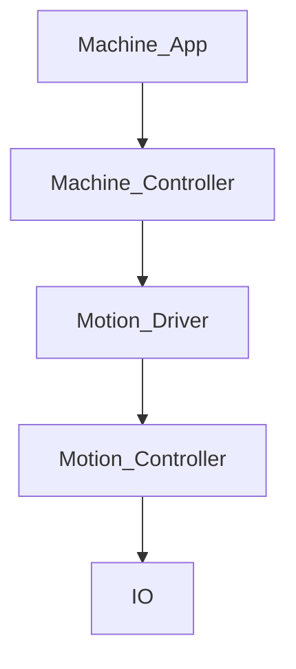

# compactor_machine_controller
Control system for compactor machine

# Digital Inputs

# Analog Inputs
## 24V Inputs
### Buttons and Switches
- Switch 1. Operating mode manual and auto
- Switch 2. Operating mode setup or as set on switch 1.
### Endpoints
- Compactor pressure
## Temperature Inputs
4x temperature sensors of type T, Fe-CuNi